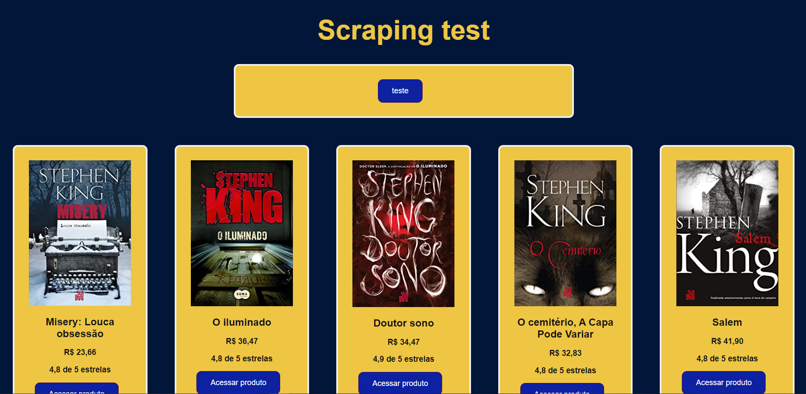

# Amazon-WebScraping-ReactJS-Flask

### Why did I use two different technologies?

### Backend

#### Well, as I've had past experiences with Python doing webscraping I chose it to be my backend (API). The framework used was Flask, because although I have already used Django, Flask allows me to create an API faster (as the purpose of the project is low complexity).

#### Flask proved to be efficient for this project, being quite easy to configure and create the route, even to return an error (500 was used) and deal with CORS (Cross-origin resource sharing). Even to return in JSON file, it has a method already designated for that.

#### Libraries used in Python-Flask:

- requests (For HTTP requests)
- BeatifulSoup (Great tool to extract web content)

### Frontend

#### I'm currently doing some projects in ReactJS (including a course in progress). So it's another personal project for me to train and learn more about this amazing tool.

#### When I did webscraping only with Python (without using Javascript or PHP), I used a library called streamlit, including some projects published here in Github, which is an excellent tool for working with data science projects, but which lacks flexibility when you want if creating styles (maybe in future updates they will improve this).

### Screenshot:

